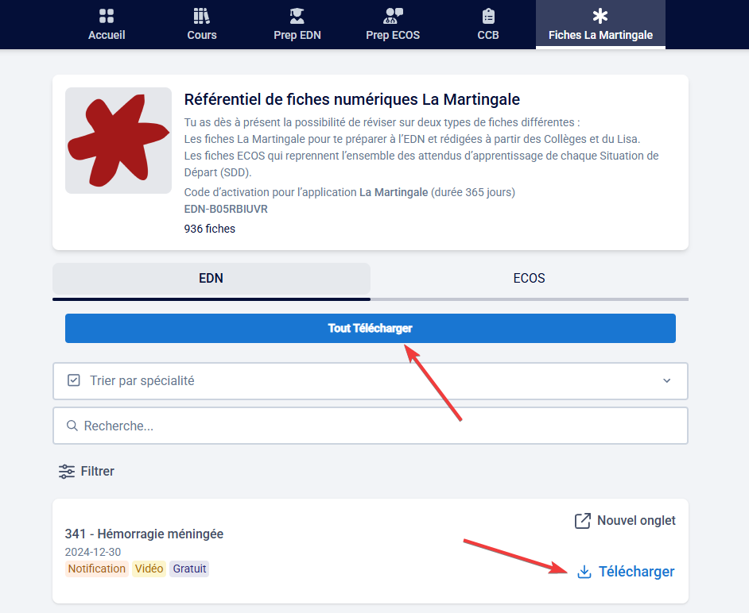

# Hypocampus PDF Downloader

Cette extension Chrome permet de télécharger facilement les PDF depuis le site Hypocampus.

## Version

## Fonctionnalités

- Ajoute un bouton "Télécharger" à côté de chaque fiche pour un téléchargement individuel
- Ajoute un bouton "Tout Télécharger" en haut de la page pour télécharger toutes les fiches en une seule fois
- Fonctionne avec l'authentification existante sur le site Hypocampus

## Installation

1. Téléchargez ou clonez ce dépôt (Bouton "Code" en vert en haut à droite - "Download ZIP")
2. Décompressez le fichier ZIP
3. Ouvrez Chrome (ou navigateur compatible) et accédez à `chrome://extensions/` (ou `edge://extensions/` pour Microsoft Edge par exemple)
4. Activez le "Mode développeur"
5. Cliquez sur "Charger l'extension non empaquetée" et sélectionnez le dossier `hypocampus-extension-master`
6. L'extension est maintenant installée et prête à l'emploi

## Utilisation

1. Connectez-vous au site Hypocampus (https://hypocampus.fr/)
2. Naviguez vers la section des fiches
3. Vous verrez un bouton "Télécharger" à côté de chaque fiche et un bouton "Tout Télécharger" en haut de la page
4. Cliquez sur le bouton correspondant pour télécharger une ou toutes les fiches

## Important

- Vous devez être connecté à Hypocampus pour que l'extension fonctionne
- Les téléchargements sont enregistrés dans votre dossier de téléchargements par défaut
- Le format des fichiers téléchargés est PDF 